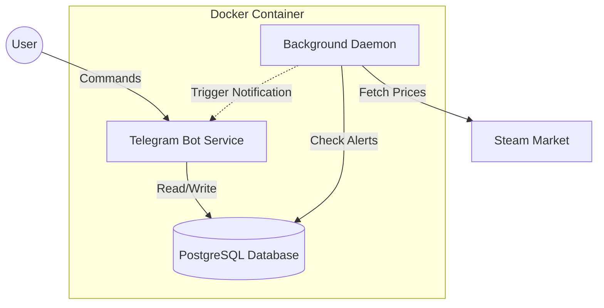

# 🔫 Steam Skin Hunter Bot


**An advanced, containerized Telegram bot for real-time CS2 market analysis, portfolio tracking, and price alerting.**

[Report Bug](https://github.com/your-username/steam-skin-hunter-bot/issues) · [Request Feature](https://github.com/your-username/steam-skin-hunter-bot/issues)

</div>

---

## 📸 Application Demo

| **Main Menu & Dashboard** | **Inventory Analysis** |
|:---:|:---:|
|| |
| *Intuitive navigation and portfolio overview* | *Detailed valuation of large inventories* |

| **Price Alerts** | **Portfolio Tracking** |
|:---:|:---:|
|| |
| *Real-time notifications when prices drop* | *PnL calculation and investment tracking* |

---

## 🚀 Key Features

### 🔔 Daemonized Price Alerts
Unlike simple bots, this project runs a dedicated background service (`monitor.py`) that monitors the Steam Market 24/7.
- **Microservice approach:** The bot remains responsive even while scraping thousands of items.
- **Instant Notification:** Alerts are triggered immediately when the target price is hit.

### 🎒 Deep Inventory Analytics
Analyze public Steam profiles with a single link.
- **High Performance:** Capable of processing 1000+ item inventories in seconds.
- **Financial Breakdown:** Calculates total value in **USD** and **UAH**.
- **Smart Filtering:** Identifies top assets and filters out "trash" items.

### 🛡️ Robust Anti-Ban System
Steam's API has strict rate limits. This project implements a sophisticated scraping engine:
- **User-Agent Rotation:** Mimics real browser sessions to avoid detection.
- **Exponential Backoff:** Automatically handles HTTP 429 (Too Many Requests) errors by pausing and retrying.
- **Jitter:** Randomizes request intervals to appear human-like.

---

## 🏗 System Architecture

The project is built on a **Microservice-like Architecture** orchestrated by Docker Compose.



## 📂 Project Structure

```text
steam-skin-hunter/
├── bot.py             # Main entry point for Telegram interaction
├── monitor.py         # Background service for price checking loop
├── database.py        # Async PostgreSQL wrapper (CRUD operations)
├── steam_client.py    # Robust API client with anti-ban logic
├── config.py          # Configuration management
├── Dockerfile         # Python environment setup
├── docker-compose.yml # Service orchestration (Bot + DB)
└── .env.example       # Template for environment variables

```

---

## 🛠 Technology Stack

* **Language:** Python 3.11
* **Framework:** [Aiogram 3.x](https://docs.aiogram.dev/) (Fully Asynchronous)
* **Database:** PostgreSQL 15 + `asyncpg` driver
* **HTTP Client:** `aiohttp` for non-blocking API calls
* **Infrastructure:** Docker & Docker Compose

---

## ⚙️ Installation & Setup

### Option 1: Docker (Recommended)

This ensures the environment is identical to production.

1. **Clone the repository**
```bash
git clone [https://github.com/your-username/steam-skin-hunter-bot.git](https://github.com/your-username/steam-skin-hunter-bot.git)
cd steam-skin-hunter-bot

```


2. **Configure Environment**
```bash
cp .env.example .env

```


*Edit `.env` and insert your Telegram Token.*
3. **Run with Docker Compose**
```bash
docker-compose up --build -d

```


*The bot will automatically initialize the database tables on the first run.*

### Option 2: Local Development

<details>
<summary>Click to expand manual installation steps</summary>

1. Create a virtual environment:
```bash
python -m venv .venv
source .venv/bin/activate  # or .venv\Scripts\activate on Windows

```


2. Install dependencies:
```bash
pip install -r requirements.txt

```


3. Ensure PostgreSQL is running locally and update `.env` with `DB_HOST=localhost`.
4. Run the bot:
```bash
python bot.py

```


</details>

---

## 🔧 Configuration (.env)

| Variable | Description | Default (Docker) |
| --- | --- | --- |
| `BOT_TOKEN` | Telegram Bot Token from @BotFather | **Required** |
| `DB_HOST` | Database hostname | `db` |
| `DB_NAME` | Database name | `steam_skins` |
| `DB_USER` | PostgreSQL user | `postgres` |
| `DB_PORT` | PostgreSQL port | `5432` |
| `UAH_RATE` | USD to UAH exchange rate | `41.5` |

---

## 🔮 Roadmap

* [x] **Dockerization**
* [x] **Price Alerts System**
* [ ] **Proxy Support** (SOCKS5/HTTP for heavy scraping)
* [ ] **Grafana Dashboard** (Visualize price trends)
* [ ] **Web Admin Interface**

---

## 📄 License

Distributed under the MIT License.

<div align="center">
<b>Star ⭐ this repo if you find it useful!</b>
</div>

```

```
